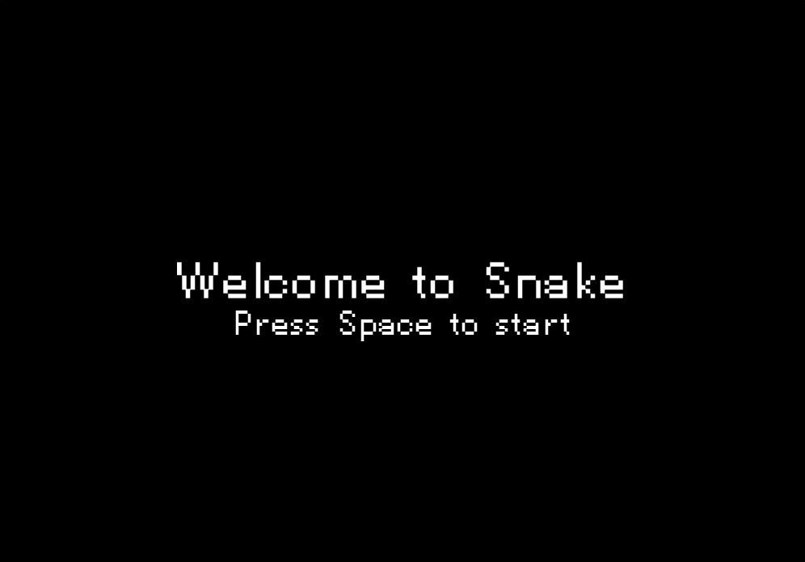
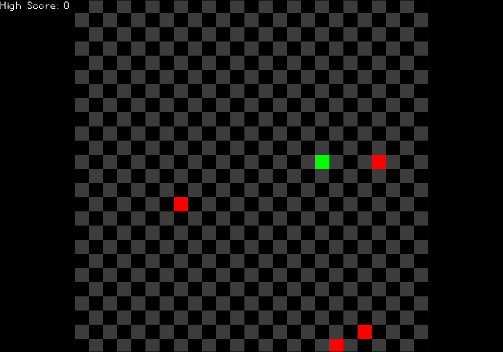
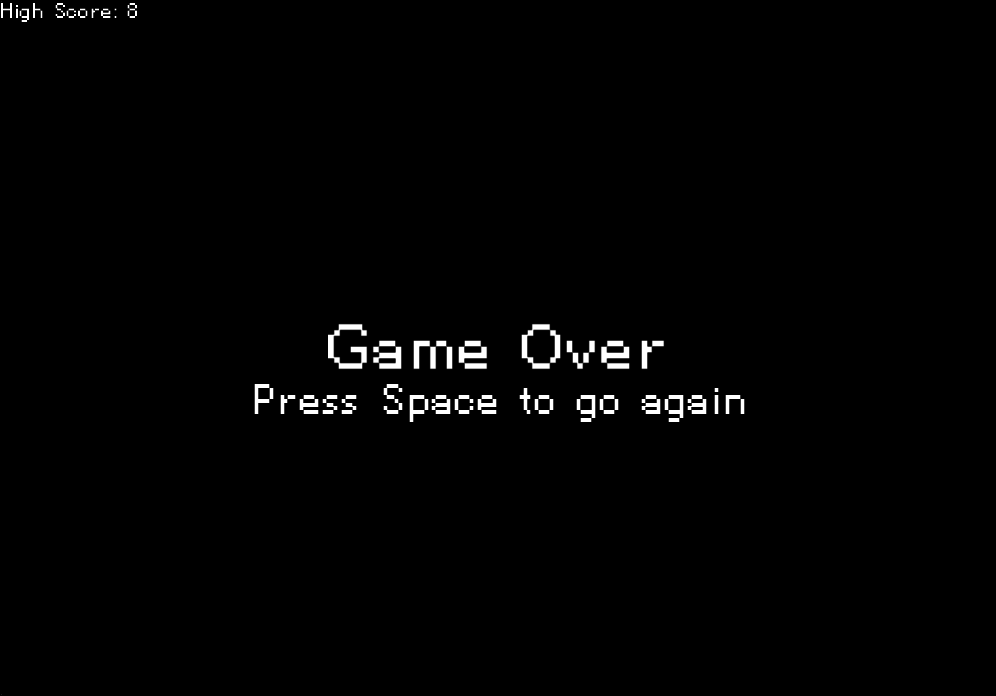

# Snake

A my own spin on the popular 80's classic with the same name.

### Table of Contents

- [About the Project](#about-the-project) 
- [Getting Started](#getting-started)
    - [Requirements](#requirements)
    - [Building the Project](#building-the-project)
    - [Running the Project](#running-the-project)
- [Game Manual](#game-manual)
    - [General Keybinds](#general-keybinds)
    - [Game Rules](#game-rules)
        - [Start Screen](#start-screen)
        - [Game](#game)
        - [Game Over Screen](#game-over-screen)

## About the Project

This project is a very basic implementation of [Snake](https://en.wikipedia.org/wiki/Snake_(video_game_genre)). It's written entirely in C++23, tested with [googletest](https://github.com/google/googletest/tree/main) and rendered using the [SDL3](https://wiki.libsdl.org/SDL3/FrontPage)  and [SDL3-ttf](https://wiki.libsdl.org/SDL3_ttf/FrontPage) libraries, as well as using the free [PixelLetters Font](https://www.fontspace.com/pixelletters-font-f22954).

## Getting Started

### Requirements

- One of the following C compilers (with C++23): [MSVC](https://visualstudio.microsoft.com/vs/features/cplusplus/)(Windows only), [Clang](https://clang.llvm.org/) or [GCC](https://gcc.gnu.org/)
- [CMake](https://cmake.org/download/). Use `brew install cmake` on macOS instead of installing the GUI version.
- Packages, that SDL3 and SDL3-ttf need to build from source:
    - [Linux guide](https://github.com/libsdl-org/SDL/blob/main/docs/README-linux.md) for SDL3
    - The [macOS guide](https://github.com/libsdl-org/SDL/blob/main/docs/README-macos.md) states that you will need Xcode 12.2 and the macOS 11.0 SDK. However I have found that having the Xcode app is not necessary. I would highly recommend installing the [Xcode Command Line Tools](https://mac.install.guide/commandlinetools/), which you probably already have if you're using git or homebrew.
    - You will need [FreeType](https://freetype.org/download.html) for SDL3-ttf. For Debian-based Distros, for example, this would be the command to install it: `sudo apt install libfreetype6-dev`
    - To install FreeType on macOS, use `brew install freetype`
    - Windows just needs [Visual Studio](https://visualstudio.microsoft.com/downloads/) 

### Building the Project

For all of the operating systems mentioned, the first few steps will always be the same:

- Create a `build` folder
- Change directory into that folder
- Fetch SDL3 and SDL3-ttf and generate platform specific build files with `cmake ..`
- Optional: add a release type flag with `cmake .. -DCMAKE_BUILD_TYPE=<type>`. The intended build types are "Release" and "Debug".
- Optional: disable test building with `cmake .. -DBUILD_TESTING=OFF`

Example cmake command: `cmake .. -DCMAKE_BUILD_TYPE="Release" -DBUILD_TESTING=OFF`

After that your build folder will either contain a `Makefile` on Linux/macOS or a `Snake.sln` file on Windows.

> [!NOTE]
> If you are using Visual Studio and wish to see all files organized and shown correctly, you should open the project from Visual Studio as a "CMake Project" instead of doing all of the steps above. The CMake configuration's own solution file does not correctly represent the project yet.
> This is due to me developing it primarily on Linux and is subject to change.

To build the game with the Makefile, run `make`

For Windows, you will need to follow these steps:
- Double click the `Snake.sln` file or use the following command: `start devenv .\Snake.sln`
- You can now either:
    - Run the program from Visual Studio directly via the green "run" button on top
    - Or build the program via the build option on the top bar

The binary file will be either directly in the `build` folder on macOS and Linux, or in the corresponding subfolder when building with Visual Studio (Release, Debug, ...).

### Running the Project

To run the game on Linux or macOS, assuming you're already in the CLI after following along, you can execute it with `./Snake` when inside the build folder. On Windows you can just double click it and it will run.

> [!IMPORTANT]
> In case you want to move the binary to another place, you need to also move the `assets` folder containing the font. The program will not run if it doesn't find it.

## Game Manual

### General Keybinds 

- Enter/exit fullscreen is bound to the Return/Enter key
- The Escape key exits the game
- To start or restart the game from the start and game over screens you need to press Space
- To change the direction of the snake you can use "WASD" or the Arrow keys

### Game Rules

#### Start Screen

When starting the game, you will be greeted by the following screen:

 

#### Game

Pressing Space will start the game, which spawns your snake in the center of the screen, with a random initial direction, along with 4 fruits. Eating fruit will increase your length, which is also your score. It will also replace that fruit with another one in a random location on the field. Your session's high score will be shown on the top left corner of the screen.

#### Game Over Screen

The game runs until the snake's head collides with its body or with a wall. You can always start a new game by pressing space again.

## Tests

The project is fully unit tested, rendering excluded. Tests get built automatically. To run them, type `ctest` in the build directory (on all platforms). Alternatively, they can be ran directly from Visual Studio on Windows.
